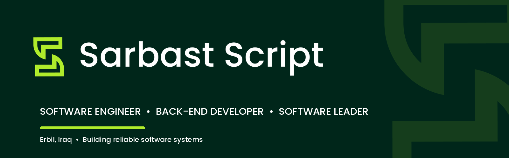
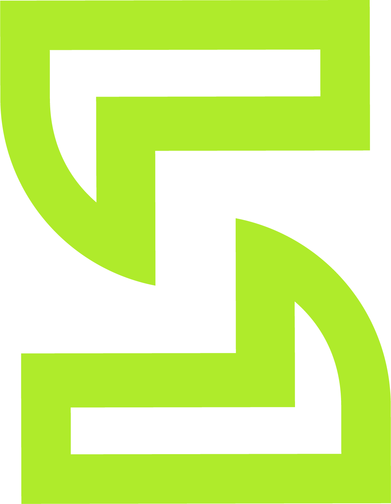

<p align="center">
  
</p>

<h1 align="center">Hi, I'm Mohammed Sarbast 👋</h1>

<p align="center">
  <strong>Software Engineer · Back-End Developer · Software Leader</strong>
</p>

<p align="center">
  I design and build reliable backend systems, scalable APIs, and maintainable software that supports real business needs.
</p>

<p align="center">
  <a href="https://sarbastscript.com">
    
  </a>
  <a href="mailto:muhammedsarbast626@gmail.com">
    
  </a>
  
</p>

---

## About Me

I am a software engineer with **5+ years of experience** designing, developing, and maintaining scalable software systems. My background combines hands-on backend engineering with technical leadership, architecture, mentoring, and delivery management.

Currently, I work at **Tishk International University (TIU)** on its **Student Information System**, where I develop backend services, APIs, and business logic while collaborating through Agile practices and writing unit and end-to-end tests.

```ts
const muhammed = {
  role: "Software Engineer",
  specialization: "Back-End Development",
  experience: "5+ years",
  focus: [
    "Scalable APIs",
    "Clean Architecture",
    "System Reliability",
    "Performance",
    "Technical Leadership",
  ],
  principle: "Build software that stays reliable long after launch day.",
};
```

## What I Do

<table>
  <tr>
    <td width="50%" valign="top">
      <h3>⚙️ Back-End Engineering</h3>
      <p>Designing APIs, business logic, database workflows, integrations, and scalable application services.</p>
    </td>
    <td width="50%" valign="top">
      <h3>🏗️ Software Architecture</h3>
      <p>Turning business requirements into clean, maintainable technical solutions and development workflows.</p>
    </td>
  </tr>
  <tr>
    <td width="50%" valign="top">
      <h3>✅ Quality & Reliability</h3>
      <p>Improving code quality through testing, code reviews, clean architecture, and continuous improvement.</p>
    </td>
    <td width="50%" valign="top">
      <h3>👥 Technical Leadership</h3>
      <p>Leading development teams, mentoring engineers, delegating work, and aligning delivery with business goals.</p>
    </td>
  </tr>
</table>

## Tech Stack

<p>
  
  
  
  
  
</p>

<p>
  
  
  
  
  
</p>

<p>
  
  
  
  
  
</p>

## Current Focus

- Building and maintaining backend modules for a university Student Information System
- Designing reliable APIs and business logic for complex workflows
- Writing unit and end-to-end tests to improve system stability
- Improving code quality, architecture, performance, and maintainability
- Collaborating with developers and stakeholders in an Agile environment

## Experience Snapshot

| Period | Role | Organization |
|---|---|---|
| Feb 2026 - Present | Software Engineer | Tishk International University |
| Apr 2024 - Jan 2026 | Head of Development | Lucid Source |
| Jul 2023 - Jun 2024 | Software Engineer | Hesta |
| Jul 2022 - Jun 2023 | Software Engineer | Tornet |
| Jan 2022 - Jun 2022 | Head of Development | Kernel |
| Jan 2021 - Dec 2021 | Full-Stack Developer | Lucid Source |

## Engineering Principles

> Clean architecture is not only about organizing code. It is about making systems easier to understand, test, maintain, and grow.

I care about the engineering decisions that may not appear in a demo but determine whether a product remains stable over time: clear boundaries, reliable tests, predictable behavior, thoughtful database design, observability, and maintainable code.

## Let's Connect

<p>
  <a href="https://sarbastscript.com"><strong>Website</strong></a>
  &nbsp;·&nbsp;
  <a href="mailto:muhammedsarbast626@gmail.com"><strong>Email</strong></a>
  &nbsp;·&nbsp;
  <strong>Erbil, Iraq</strong>
</p>

<p align="center">
  
</p>

<p align="center">
  <strong>Sarbast Script</strong><br />
  Building dependable software with clarity, purpose, and continuous improvement.
</p>
